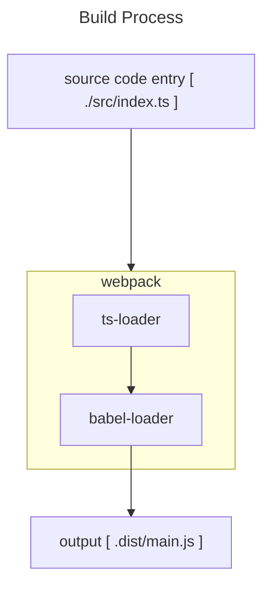

# typescript-playground

## Table of Contents

-   [typescript-playground](#typescript-playground)
    -   [Table of Contents](#table-of-contents)
    -   [Getting Start](#getting-start)
    -   [Build Process](#build-process)

## Getting Start

> **IMPORTANT**
> Where is the entry points
>
> ```txt
> ./src/index.ts
> ```

> **NOTE**
> How to build
>
> ```shell
> npm run build
> ```

> **NOTE**
> How to watch change and output automatically
>
> ```shell
> npm run watch
> ```

## Build Process


